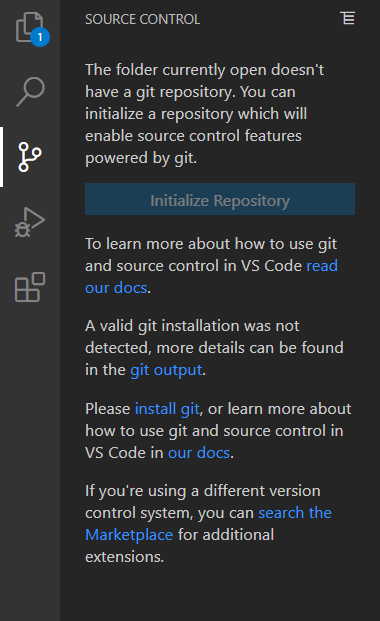

# GitHub Guide (Graphical User Interface)

This chapter introduces several programs to use Git
- - -
## Visual Studio Code

You can download Visual Studio Code [here](https://code.visualstudio.com/).

3rd from left menu is the Git GUI plugin
- - -

## Github Desktop

You can download Github Desktop [here](https://desktop.github.com/).

It supports multiple Git commands through GUI

Next chapter we start to describe the mechansim of Git