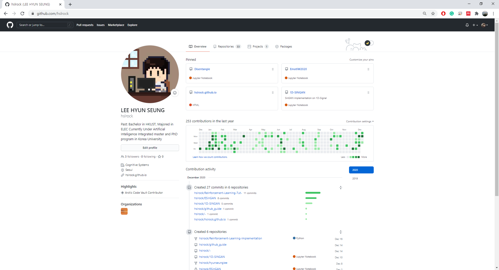

## GIT: Starting the Version Management (Basic)

Before Git was published, SVN(SubVersion) was the main version management system in the development industry. The big difference between Git and SVN is that. Git does not save the changes in the commit but saves the whole code. 

It sounds Git is much slower than SubVersion. It is the opposite because when there were multiple commits such as 100, and wish to move to the first commit, we must calculate 100 differences. This computation is unnecessary as Git saves the snapshot.

Let's check how Git keeps tracking the files using diagrams. This could be important for the next chapters with new concepts.

 
After `git init` we created two files README.md debug.py. These two files were never committed and are referred to as  'untracked' files
 

Using `git add` we 'stage' two files. Now files are changed from 'untracked' to 'staged'

Using `git commit`, files are now moved to 'unmodified'. We created a snapshot/version These 'unmodified' files can be modified

Using `git push`, we can upload files from the local repository to the remote repository. 

We can modify 'debug.py' and make a new file 'debug.html'. The status of 'debug.py' is modified and 'debug.html' is untracked.

Unmodified 'README.md' cannot or does not require to be staged as it is not modified. However, the other two files can be staged with `git add` *' README.md' is already on the stage.

If we `git commit`, the following files are committed/snapshotted and `git push` will add a new version/snapshot to the remote repository.